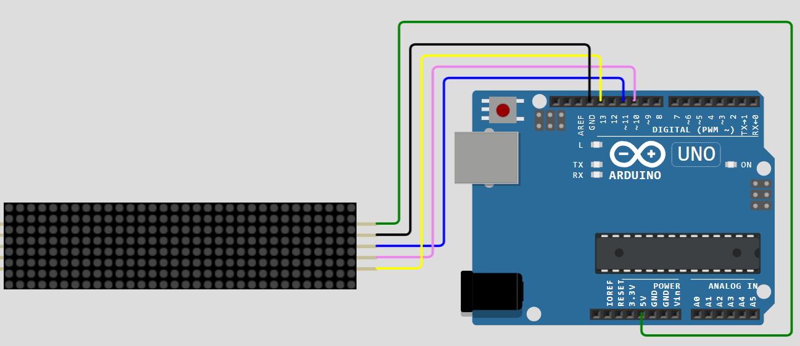

# ARD-002-LED-Matrix-Text-Display-using-Arduino-UNO
A fun project using Arduino UNO and a MAX7219 4-in-1 dot matrix display module. You can display scrolling text, numbers, or custom patterns on the LED matrix using Arduino programming.

---

## 🛠 Components Required

1. [Arduino UNO R3 (Compatible)](https://robocraze.com/products/uno-r3-board-compatible-with-arduino?_pos=3&_psq=ARDUINO&_ss=e&_v=1.0)
2. [MAX7219 4-in-1 Dot Matrix Display Module](https://robocraze.com/products/max7219-4-in-1-dot-matrix-display-module?_pos=4&_psq=MAX&_ss=e&_v=1.0)
3. [Jumper Wires (Male-to-Female, 20cm, 40pcs)](https://robocraze.com/products/f2m-jumper-wires-20cm-40pcs?_pos=1&_psq=JUMPER+WIRES&_ss=e&_v=1.0)

---

## 🎥 Project Demo

Check out the working demo on Instagram:
👉 [Watch the Reel](https://www.instagram.com/reel/DNKNIpbzgMQ/?igsh=aTl1M2M5dDByc3Yz)
---
## Circuit Diagram

